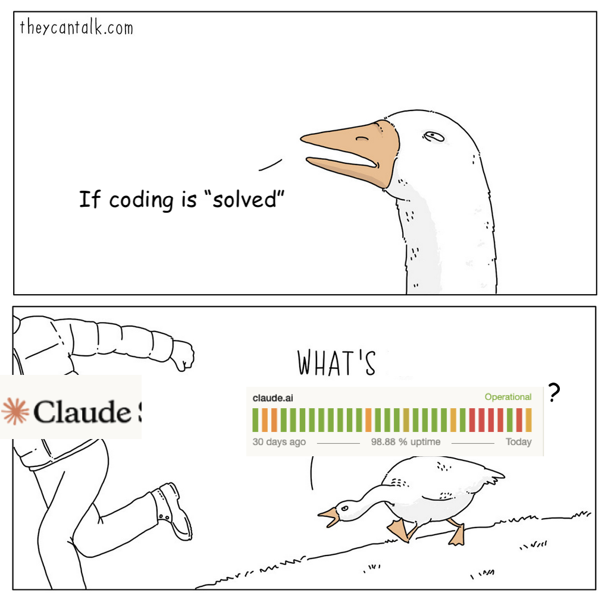

We have entered a period in which AI is able to author more code than is reviewable by humans. Many teams are already past the point where each line can realistically be scrutinized; the volume of code being generated is increasing faster than our capacity to inspect it. Every AI-assisted coding session produces choices: naming decisions, structural decisions, abstraction decisions, dependency decisions. Some of these are good, some less so, and the ratio of decisions being made to decisions being reviewed by a human is growing.

A reasonable response is to insist that humans continue to review every line of code, to resist the siren call of the [dark software factory](https://factory.strongdm.ai/) and keep a human in the loop at least at the review stage. I'm sympathetic to the goal, but it isn't tenable over the medium term.

What I want to argue instead is that engineering teams should lower the bar on code review and raise the bar on what users actually see. The work that leaders have traditionally treated as overhead or debt paydown—tests, observability, monitoring, guardrails—should be reclassified as core product work, because it's the stuff that makes AI-assisted velocity sustainable. In exchange, we should be less precious about the kind of code-level scrutiny that used to justify itself when humans wrote every line.

## Software is what it does

The cost of _creating_ software seems to have dropped by something like an order of magnitude, depending on the task. The cost of _maintaining_ it probably hasn't dropped nearly as much, because maintenance requires knowing something is wrong, and invisible debt is invisible.

To see why, it helps to return to the source. Ward Cunningham, who coined "technical debt" in a [1992 OOPSLA paper](https://c2.com/doc/oopsla92.html), didn't mean what most people think he meant. "Shipping _first time_ code is like going into debt," he wrote. The debt isn't the product of taking shortcuts; it's the gap between what the code expresses and what the team has since learned about the problem. Fowler [categorized this](https://martinfowler.com/bliki/TechnicalDebtQuadrant.html) as "prudent-inadvertent" debt: the kind that accrues even when good teams do good work, because understanding deepens faster than code can reflect it.

AI-generated code creates something closer to Ward's original meaning. Ward assumed a team whose understanding had deepened past what the code expressed; the debt was the lag between learning and refactoring. AI has a somewhat different challenge: the model operates within the light-cone of its context window and whatever plans it writes for itself downstream of that context. It doesn't know your business, your users, or your architecture beyond what it can see right now. It makes locally reasonable choices that may be globally suboptimal, and it does this at scale, thousands of times per day. The code works; it passes the tests. But it nonetheless accumulates a kind of ignorance that no one chose and that is difficult to notice, not because the team learned something the code hasn't caught up with, but because the code never knew it in the first place.

This changes which costs you should worry about. Structural debt—messy abstractions, duplication, poor naming—matters less when AI has collapsed the cost of refactoring. If a tangled service layer is slowing you down, it can be rewritten in hours instead of weeks. The economic argument for tolerating some mess has gotten a _lot_ stronger.

The cost that's gone up is user-facing: features that don't work as they should, error states no one tested for, performance degradation your users suffer from before you notice. This is the debt that accumulated ignorance produces at scale. Not messy code, but code that doesn't know what it doesn't know. And if the debt was accumulated invisibly, by an AI making thousands of locally reasonable decisions, you might not know until a customer tells you. Or until they leave.

## Build the systems that catch what you missed

If the core risk is accumulated ignorance—code that doesn't know what it doesn't know—then the response isn't to review every line. It's to build systems that surface the consequences of what you missed.

Mitchell Hashimoto wrote recently about a practice he calls "[harness engineering](https://mitchellh.com/writing/my-ai-adoption-journey)": anytime you find an agent making a mistake, you engineer a solution so that it never makes that mistake again. Better AGENTS.md files, custom scripts, automated checks. It's the discipline of building upstream guardrails, and it's very similar to where StrongDM landed with [DTU](https://www.strongdm.com/blog/the-strongdm-software-factory-building-software-with-ai) (stub services taken to their logical extreme).

I like this framing, but I treat it as one end of a spectrum. Yegge once observed that one of Amazon's lessons from its SOA journey is that [monitoring and QA are the same thing](https://gist.github.com/chitchcock/1281611): both are systems for detecting whether your software is behaving as intended, just at different points in its lifecycle. On the upstream end, harness engineering makes the LLM less likely to produce bad code in the first place. On the downstream end, observability, error monitoring, and post-deploy smoke tests catch the impact of what slipped through. Neither alone is sufficient; together, they form the quality infrastructure that makes AI-assisted velocity survivable.

AI has made *all* of this cheaper to build. Comprehensive test suites that would have taken weeks can be generated in hours. Observability instrumentation that teams used to defer indefinitely can be set up in an afternoon. Error monitoring, synthetic tests, performance benchmarks—all more accessible than they've ever been.

This work is no longer overhead. In a world where AI is generating code at volume and humans cannot review all of it, quality infrastructure *is* the product work. It's the investment that makes the speed sustainable and the ignorance manageable. Teams should be given explicit time and mandate to build it, not asked to squeeze it in around the edges. The cost has dropped far enough that the old excuses don't hold; the old habits of treating it as a second-class priority still do.

## Quality engineering _is_ software engineering

These are two sides of one strategy. You can be less precious about structural debt: duplicate functions, awkward abstractions, poor naming conventions. These matter less when the cost of fixing them has collapsed. You have to stop treating every imperfection as a hard-blocking gate. Your users do not care about your internal code aesthetics.[^1]

In exchange, be *more* rigorous about what your users actually experience. If you're going to let AI generate code at volume, you need to be confident that you'll know when something breaks. Instrument aggressively. Test comprehensively. Monitor what your users see.

These two moves are inseparable, in much the same way that continuous delivery requires increased rigor around pre-deploy validation. Relaxing scrutiny on code internals only makes sense if you've invested in the quality infrastructure that catches user-facing problems. The trade is: spend less time reviewing code, spend more time building systems that tell you when the code is wrong. *Quality builds safety, which builds speed.*

The rate at which unreviewed code accumulates is accelerating. The response isn't to slow down, and it isn't to pretend that human review can scale to match. It's to redefine what constitutes responsible engineering practice: less gatekeeping, more instrumentation. Less time reading diffs, more time building the systems that make diffs less consequential when they're wrong.

[^1]: I have never once heard a customer say, "I would have renewed, but I could tell your service layer had some code duplication." Code duplication _can_ have downstream effects, but the effects are observable. Focus on what they can see.
