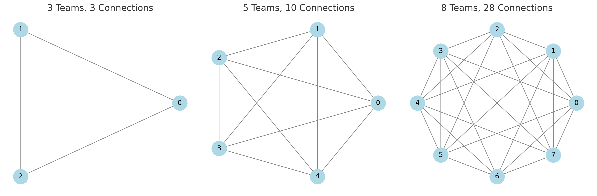

One of my favorite pieces of writing on the intersection of software architecture and business strategy is [Steve Yegge's Google Platforms Rant](https://gist.github.com/chitchcock/1281611). Published in 2011 for an internal audience at Google but accidentally leaked to the rest of the internet, it remains useful reading fifteen years later. It isn't perfect—some pieces, like its core thesis, haven't aged well—but its insights into how software architecture intersects with business strategy and organization structure are timeless.

## The core argument

Google (as of 2011) did most things better than Amazon, Yegge argued, but the few things Amazon did better more than made up for the difference. The most significant was a technical strategy that forced them to platformize their internal systems, built on these rules:

1. All teams expose their data and functionality through service interfaces.
2. Teams must communicate with each other through these interfaces.
3. No other form of interprocess communication is allowed.
4. All services must be designed from the ground up to be externalizable.

In other words, they went hard into SOA.

This bought Amazon two things: it cut down on cross-team communication by forcing all negotiation through service boundaries, and it allowed them to turn those boundaries into monetizable products. Anything useful enough for Amazon to build for itself could be offered to the market. This is how they arrived at S3 and EC2, the anchor products of AWS.

Yegge argued that Google risked losing in the market if they didn't take a platform-first strategy seriously. His specific prediction was that Google+, then a Facebook competitor, would fail due to weak platform support.

### An aside on Yegge's intended audience

Yegge was writing by and for Google engineers, who understood implicitly that Google and Amazon had made fundamentally different architectural bets, though Yegge skirts around it in the memo.

In contrast to SOA, Google worked inside a monorepo: one massive codebase, shared across the company, with sophisticated internal tooling (Blaze, later open-sourced as [Bazel](https://bazel.build/)) to manage builds and dependencies. This approach optimizes for code sharing, large-scale refactoring, and a unified developer experience. It requires heavy investment in tooling but allows any engineer to see and modify almost any code.

Monorepos can still build services, and indeed has to; at Google's scale, you need to be able to run multiple discrete binaries in different ways based on workflows. But you don't necessarily approach service-to-service communication through an network-boundary-interface-first lens.

Both strategies are optimized for different outcomes, but Yegge was writing for an audience that had generally mostly lived in Google's world. He was attempting to explain that *the architectural choice they took for granted has business consequences they weren't seeing*, which is a risk we all run. His rant makes more sense once you understand he's contrasting with an implied default.

## The lessons I take away from this

Yegge's rant is a Rosetta Stone for high-tech architecture strategy. It clarifies how companies arrive at architectural decisions, how architecture intersects with business strategy, and why technical excellence doesn't guarantee market success. I come back to it periodically to sharpen my understanding of where my own organizations are heading.

You could spend all day picking it apart, but here's what I get out of it.

### 1. Architecture should match business strategy

Form follows function. Amazon adopted SOA because they were solving a business problem, not a tech problem: how to effectively monetize investments in platform-level software. Their SOA strategy was driven and mandated by the founder, born out of a vision for how he wanted his company to grow. It wasn't a consequence of engineering ambition.

This sounds obvious but plays out strangely in practice. Engineers often advocate for architectural patterns because they're intellectually interesting, or because a respected company uses them, or because they solve problems the organization doesn't actually have. SOA is particularly susceptible to this: it *feels* like the sophisticated choice, and criticizing it can seem unsophisticated.

But architecture has costs, and those costs should buy something strategic. Amazon's SOA overhead was justified by a platform business model. If your company sells widgets and has no intention of becoming a platform company, you're paying the complexity tax without the strategic benefit. There are workable alternatives—including just accepting more cross-team coordination—that might suit your actual situation better.

The question isn't "what's the best architecture?" It's "what's the best architecture *for what we're trying to accomplish*?"

### 2. Cross-team collaboration is an antipattern at scale

One of the business problems Amazon was trying to solve was *how to organize teams*. This is a hard-won lesson for me personally, but Bezos knew it early: asking teams to reach across boundaries is often counterproductive, because the number of communication paths explodes as the org grows. Decoupling teams forces service-level autonomy and encapsulation, which can avoid distributed-monolith problems later.

The key phrase here is "at scale." Small organizations can and should collaborate freely—the overhead of service boundaries isn't worth it when everyone fits in one room. But somewhere between 20 and 200 engineers, informal coordination stops working. Decisions that used to take a conversation can no longer rely on implied trust to build alignment.

SOA offers one way to manage this transition by replacing human coordination with machine contracts. Instead of asking another team to do something, you call their API, and negotiate priorities them through interface design. It's impersonal by design; its strength is that it doesn't require everyone to know everyone else.

The modern vocabulary for this comes from *Team Topologies*: stream-aligned teams own products, platform teams provide capabilities, and interaction modes (collaboration, X-as-a-service, facilitation) are explicit choices rather than defaults. Yegge's insight predates this framing but rhymes with it: the goal is to make team boundaries load-bearing, so coordination costs don't eat your productivity.

### 3. Pick teams to reflect the architecture you want

The [Inverse Conway Maneuver](https://jonnyleroy.com/2011/02/03/dealing-with-creaky-legacy-platforms/) describes an org structure strategy intended to produce a desired architecture by building teams that reflect that structure, rather than evolving them independently. Creating teams independent of your services topology and then asking everyone to cross domain boundaries to ship is workable but slow: trickling changes across the stack from service to service can take days or weeks as each team reviews and critiques the requisite change requests. Focus is everything. Lose that and you lose the productivity gains from SOA.

*Team Topologies* (Skelton and Pais) provides a useful framework for thinking about this deliberately. Not every team should be structured the same way. Stream-aligned teams own end-to-end delivery for a product or capability. Platform teams provide internal services that reduce cognitive load for stream-aligned teams. Enabling teams help other teams adopt new capabilities. Complicated-subsystem teams own areas requiring deep specialist knowledge.

The insight is that team structure isn't just about reporting lines—it's about cognitive load and interaction modes. A team can only hold so much complexity in its head. If a service requires expertise in payments, fraud detection, compliance, and three external vendor integrations, that's probably too much for one team to own well. The architecture should reflect realistic boundaries of human attention, not just logical domain decomposition.

In practice, this is politically difficult. Organizations have existing structures, reporting lines, and headcount allocations that don't map cleanly to desired service boundaries. Reorgs are disruptive and often resisted. The path of least resistance is to leave the org chart alone and hope the architecture will evolve to match business needs.

It usually doesn't. What you get instead is services that reflect historical accidents—who was available when, which team had budget, what the org chart looked like three years ago. The architecture becomes a fossil record of past decisions rather than a reflection of current strategy.

Amazon's approach was to make this explicit: the org chart *is* the architecture. If you want to change how services relate to each other, you change how teams relate to each other. This is disruptive and often uncomfortable, but it's honest about the coupling that exists regardless. You can pretend your architecture is independent of your org structure, but Conway's Law suggests you're fooling yourself.

### 4. Services gain value by solving real problems

I'm a "services capitalist": services accrete value organically based on an organization's actual needs, not by perfectly fitting themselves to a paper definition of a domain boundary. The team trying to add the value drives the work. If nobody wants to use your service, that's a signal.

Presumptive externalizability reinforces this. Even if you never sell a service to external customers, designing as if you might forces you toward well-encapsulated problems with clean interfaces. A service that couldn't survive being offered to the market probably isn't solving a sharp enough problem to justify its existence internally either.

This also means worrying less about taxonomic purity. Not every valuable service owns its own data. Some aggregate, some transform, some orchestrate. The question isn't "does this fit the platonic ideal of a service?" but "is the problem this solves valuable enough to drive adoption?" If the answer is yes, you can sort out source-of-truth concerns later.

### 5. A service's technical domain must fully encapsulate its business domain

In the Amazon model, you *have* to fully encapsulate your domain, because teams aren't allowed to talk to one another. You can't and shouldn't trust them. Many teams try to duck hard implications of this, like service-level IAM-style authorization, but you can't correctly externalize a system without it. Amazon services may not understand everything about every user, but they're perfectly capable of granting access based on the IAM permissions the caller has. Service contracts should include cross-functional considerations like these.

Authorization is the most obvious example, but the principle extends further. If your service handles sensitive data, encryption and audit logging aren't someone else's problem—they're part of your domain. If your service has uptime requirements, monitoring and failover aren't optional add-ons—they're contractual obligations. If your service is part of a compliance scope, you own that compliance, not some central team that's never seen your code.

This is where a lot of SOA implementations fall short. Teams carve out a functional domain—"we own payments" or "we own user profiles"—without accepting the cross-functional responsibilities that come with it. They rely on shared infrastructure, central security teams, or the assumption that someone else is watching the dashboards. That works until it doesn't, and when it doesn't, nobody knows who's responsible.

Full encapsulation is expensive. It means every team needs some security expertise, some operational expertise, some awareness of compliance requirements. The alternative—specialized central teams—reintroduces the coordination overhead that SOA was supposed to eliminate. There's no free lunch. You either pay for autonomy with redundancy or pay for efficiency with coordination.

### 6. SOA is costly even when you do it right

SOA is not a trivial architecture, and there's more than twenty years of industry lessons to draw from. The most important one: even a well-executed SOA has significant costs, and a poorly-executed one can leave you worse off than a monolith.

The obvious failure mode is the distributed monolith—services tightly coupled through shared databases, synchronous call chains, or coordinated deployments. You inherit all the operational complexity of a distributed system without any of the autonomy benefits. Debugging becomes a murder mystery where, after days of investigation, you discover the killer was your own service all along.

But you can avoid the distributed monolith and still struggle. Service boundaries introduce latency and failure modes that don't exist in a monolith. Each service needs monitoring, alerting, deployment pipelines, on-call rotations. Coordinating a feature that spans three services takes longer than changing one codebase, even when everyone's doing it right. The organizational discipline required to maintain clean boundaries is expensive and ongoing.

Amazon accepted these costs because externalizability was strategic. They were building toward AWS. If you're not building toward a platform business, think hard about whether you're buying capabilities you'll actually use—or just adding overhead.

### 7. Platform teams operationalize Yegge's insight, but at a cost

In the fifteen years since Yegge's rant, the industry has converged on a pattern that attempts to capture his insights without Amazon's extremism: the internal developer platform.

The pitch is appealing. A dedicated platform team builds shared capabilities—CI/CD, observability, deployment, service templates—and offers them to product teams as internal products. The platform team thinks like Yegge's Amazon: their "customers" are other engineers, and adoption is the measure of success. If the platform doesn't solve real problems, teams route around it.

But there's a cost that the IDP discourse often obscures: every engineer on a platform team is an engineer *not* shipping product. They're not placing bets that could pay off in revenue or growth. For this tradeoff to make sense, the platform team needs to deliver *multiplicative* impact—making each product engineer meaningfully more effective, not just marginally more comfortable.

Interestingly, monorepos make this case easier to prove. Google's investment in Blaze, Forge, and their testing infrastructure is obviously load-bearing: everyone uses the same build system, so improvements benefit everyone automatically, and you can measure impact directly in build times and developer throughput. The leverage is visible.

In an SOA world, platform leverage is harder to demonstrate. Adoption is optional. Teams can route around internal tools to third-party services. You're competing in a market—internal and external—and if your platform loses, you're paying for a team that's actively being ignored.

The lesson isn't that platform teams are good or bad. It's that they're an investment with opportunity costs, and the architectural context shapes how legible that investment is. Yegge's framing helps clarify what platform teams need to deliver: genuine leverage through externalization discipline, not just a reorg that feels productive.

### 8. Architecture enables strategy but doesn't guarantee outcomes

Yegge's core prediction—that Google+ would fail due to weak platform support—turned out to be wrong, or at least wrong about the mechanism. Google+ failed because it offered no compelling differentiation from Facebook and antagonized users through forced integration with other Google products. Platform APIs weren't the issue. Network effects and product strategy were.

But his broader concern about Google's platform weakness has proven more durable. GCP has struggled to catch AWS despite Google's technical prowess, and the reasons rhyme with Yegge's critique: services that feel like internal tools exposed to customers rather than products designed for external developers. Google has found genuine niches—BigQuery, Vertex AI, GKE—but the overall platform story remains weaker than AWS's.

Meanwhile, Stripe has built one of the most successful platform businesses of the past decade while running a monorepo. Architecture didn't prevent them from thinking platform-first.

The lesson isn't that architecture determines destiny. It's that architecture *enables or constrains* strategic options. Amazon's SOA made externalization natural; Google's monorepo made it harder. But execution, timing, and product sense still matter more. A perfect architecture can't save a product nobody wants, and a suboptimal architecture won't stop a team that deeply understands its market.
