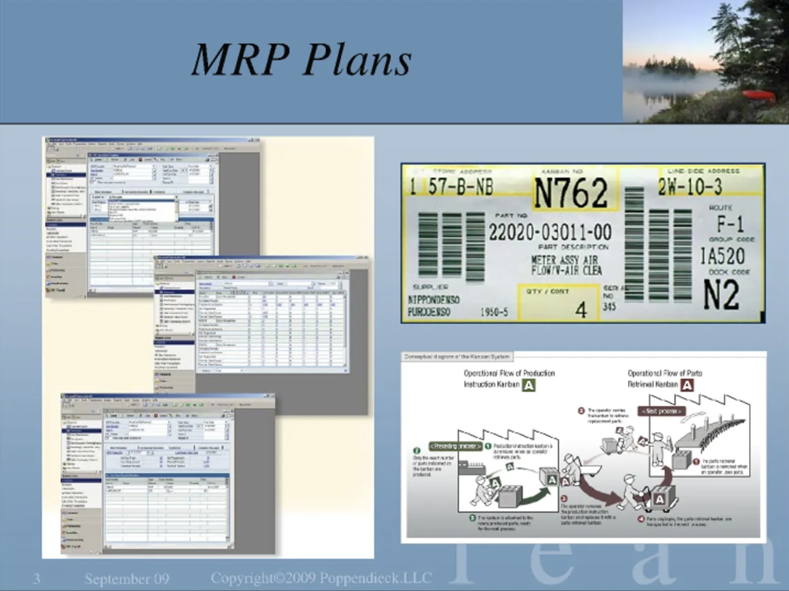
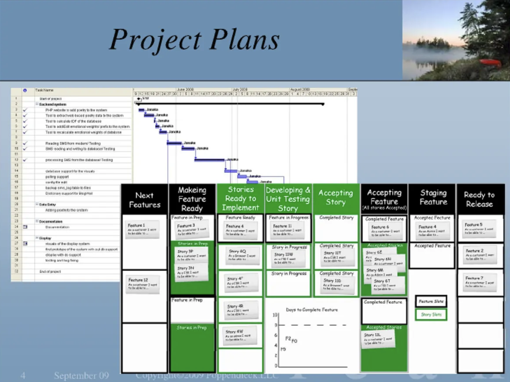
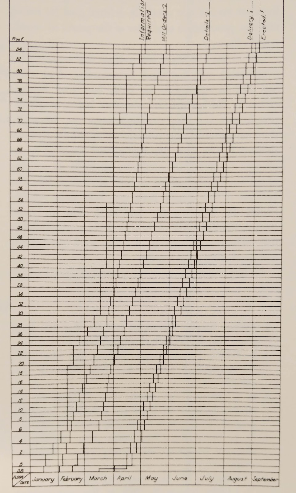
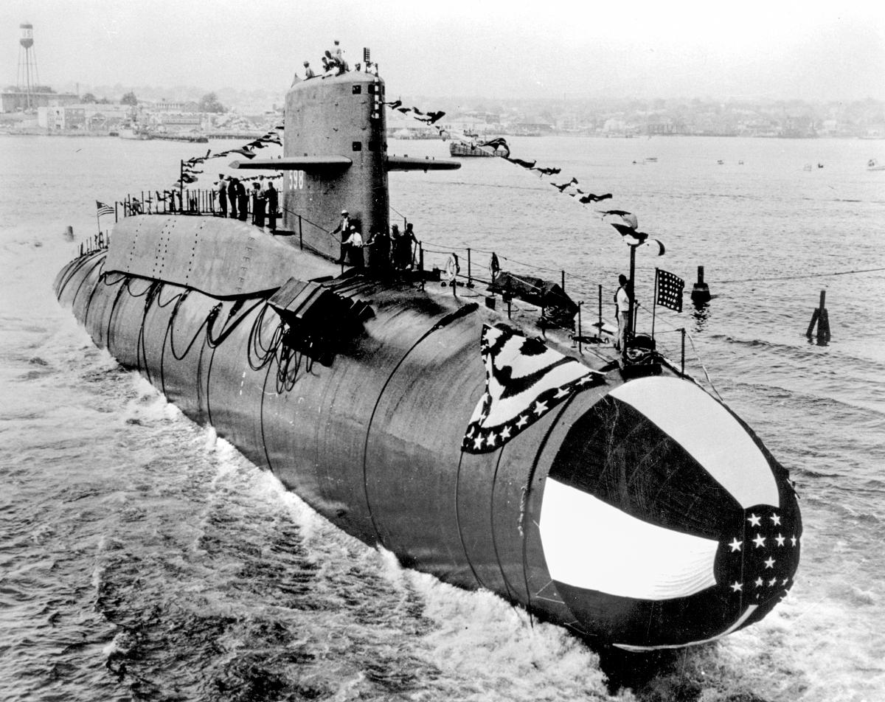

_This is a transcription of a talk given by Mary Poppendieck, [The Tyranny of the Plan](https://www.infoq.com/presentations/tyranny-of-plan/), lightly edited by me for readability and brevity. A similar transcription was previously [hosted here](https://chrisgagne.com/1255/mary-poppendiecks-the-tyranny-of-the-plan/), with Mary's permission, but has since been taken down. I share it here because I think it's an important talk and worth preserving, and I hope it will as be useful to others as it has been to me. All insights are hers, and errors mine._

## Where do plans come from?

Today I'm going to talk about the Tyranny of the Plan. And I'm going to start with the question of, well: where do plans come from? 

That's where they come from, OK? They get generated on some computer or other. And actually, if you read back in your history, there weren't that many detailed plans before there were computers to put them together. 

I was in manufacturing plants in the 1980s and I was the IT manager, and the thing I managed was a material requirements planning (MRP) system.

An MRP plan looks sort of like this.

It has all kinds of details about how each workstation would be scheduled and exactly what each workstation in the plant would do every single day. The problem with that is that it _didn't work_. There was a body of knowledge that you could get certified in called APICS—American Production and Inventory Control Society—and I got certified Fellow-level—I passed every test at the highest level. I learned every single way there was to forecast you can imagine, and how to put together all of these MRP systems.

One of the things I learned was about a "nervous MRP." A nervous MRP means that if you don't do something exactly the way that the plan says you're supposed to, things start going haywire really fast, and very soon everything is wrong and doesn't match the plan anymore. And so you have to re-plan. When you re-plan, everything starts from zero base. When you take a look at it the next morning, it's totally different than what you were doing yesterday, and things have to be shuffled around. Everything has to change, and it doesn't work, it just jumps all over the place. You can't replan every week, because replanning just sort of makes everything go strange. It doesn't take reality into account.

So the MRP plan never worked. But the message we always heard was: if only you would try harder to do exactly what the plan says, the MRP system _will_ work. Have you ever heard that before?

### "We thought they were nuts"

But then we learned about this thing called a Kanban board. When we heard they were doing this kind of stuff at Toyota, we thought they were nuts. How could it possibly work? But we tried it in our plant and we found that it worked very well. Before we went to using a pulse system with Kanban, we were able to pack out of the end of our plant something like 60 to 62% against plan every single week. Not very good, right? It was really the best that anybody could do with that kind of a plant.

One weekend after several months of preparing, we cut over to a pull system—a Kanban system—and the next week, guess how much we packed out against plants—95%! And it went up after that.

So MRP planning didn't work. You couldn't do what it said you were supposed to do. But a pull system, a Kanban system where you have cards that go from here to there, they cause production to get made. It worked in our plant, and it works reliably in manufacturing when you figure out how to make it work right.

And then there's project plans. OK, so you've all seen that, right?

And how well does that work? It gets about as nervous as an MRP plan whenever you don't do exactly what the plan says. Now this is just for one project, but what if you have a plan for 15 projects and you're going to swap teams in the middle? How well does that work? It's just about as nervous as any other detailed planning of stuff that has variation in it.

So what _has_ turned out to be better—and what this conference is all about—is something a little bit more like this: it's basically a Kanban board to _pull_ your software through the system while limiting work in process at the same time.

## The Empire State Building

There's another kind of plan, construction plans, which again are computerized. And how well do they work? About as well as all those other computerized plans. The minute it rains, or somebody doesn't show up, or takes a little bit of extra time or something like that, it falls apart.

There's an organization called the Lean Construction Institute that's got a huge amount of stuff work done in this area. And they've devised something called the Last Planner System, which is a weekly planning mechanism whereby you look at what's supposed to more or less happen based on the plan and what actually happens and you commit to the next week of work. In that way, you actually get huge amounts done—more than if you try to follow a plan like this. 

Back when computers started generating all of this detail was when we started getting nightmares about how are we supposed to follow it. I don't know that this kind of detailed planning works for any area where it's been tried. When there's any kind of variation, there's no track record of it working.

People have been building buildings for a long time. Now, we didn't try to do manufacturing with an MRP system until computers came around, and we didn't actually try to do project planning in detail until computers came around, but we've been building buildings for a century or more, great big massive skyscrapers. So you gotta ask yourself: what did they do before computers? Maybe there's something that we could learn from.

### "Did you know that they built the Empire State Building in _eight months?_"

It wasn't _exactly_ eight months. They started in September 1929—they signed a contract September 21st and started demolition on September 22nd—and what happened the next month? The stock market crashed. Virtually all of the other buildings that were planned and on the drawing board were canceled in New York City at the time, but this one got built on January 22nd 1930.

The site had already been cleared; it had quite a few 20-story buildings on it. On March 17th—this is Saint Patrick's Day, and it's not an accident—they started the steel construction. 

On November 13th it looked like this, so this from March 17th till November 13th, that's the eight months that he was talking about.

In eight months they put it up: the stones, all of the exterior. And then on May 1st, 1931, the next May, it opened. There was a reason why it had to be on May 1st: because in New York City at the time the leases for all buildings started on the 1st of May every year. So when they signed the contract on September 21st, the agreement was that it would open May 1st, 18 months later. It _had_ to in order to be able to take advantage of the leases, so that was the rule. 

It was basically exactly on time—and in fact it was 18% under budget.

Now you could maybe say it was under budget because of the Depression, but actually it wask under budget _because it was on time_. When it comes right down to it, the amount of money you spend in building a building has a huge amount to do with how much time you have people on site. The materials are pretty much gonna cost the same amount of money.

### "The deal was that you started in the spring"

In New York City at the time, this was normal. Remember, no computers, really, nothing even like a computer. They were able to build the Chrysler Building in 18 months; it was completed 1 year before the Empire State Building and it's 66 stories tall. It was competing with this other building, 40 Wall St, which is also 66 stories tall and it was built in 1 year, not 18 months, from the time that they started demolition until the time of occupancy. 1 year! And the reason why this one was built was to compete with this one to be the tallest building in the world.

When Walter Chrysler saw that 40 Wall St was putting all that stuff on top, he went to his architect, and he said, Think of something. You've got to be taller than them. So you see this spire thing, okay, so that's what he thought of. They actually built it inside the building so that nobody could tell that they were doing it, and then they jacked it up after the newspapers gave these guys credit for being taller than that one. Then one day, one noon they surged and jacked it up, and then they bolted it in place, and they didn't tell anybody, and it took 2 weeks for people to notice that this building has suddenly gotten bigger than the first one.

But anyway, the real reason why they're there is because they _knew_ how to build buildings fast back then in the 1929, 1930 time frame. It was routine. The deal was that you started in the in the spring; you built the outside and got done by fall when the bad weather came. You spent the winter finishing up the interior and on May 1st it was open. That's how the tall skyscrapers in New York were built routinely.

### "A band marching through the building and out the top"

So how did they do it? They didn't have a plan which laid out the detailed tasks that everybody was supposed to do; they focused on the workflow instead. I wanna show you a quote schedule for the Empire State Building, this is the steel schedule.

It's 85 stories, right?, and here's the months January, February, March, April through till September and this line going this high diagonal, that is when the first overall plan for the steel was completed. First is, design of the steel was completed on those dates.

They actually they had two steel mills. They had steel mill A, steel mill B, steel mill A, B. See that? And every so often, every few stories, they switched to a different supplier so that they never would get behind. This is the 3rd 1. This is when the detailed design of each level of steel was done. This is overall design. This is detailing because it's load bearing. It's, it's different for every floor, actually 2 floors at a time because the columns are 2 stories tall. So this is when they did the detailed design and this is when the delivery happened and this is when the construction. So this is delivery on site and within a week it's, it's up in the air. It's there. OK, so that's how they did the flow. Now if you look at this, this is a workflow design order detail design, delivery. Delivery and construction that every one of them goes through the same workflow and they just do it as an offset. Now the entire building was built this way. 

OK, they said we thought of it as _a band marching through the building and out the top_. It doesn't matter if it was steel or whatever. 

### The four pacemakers

They had four pacemakers. 

First of all, you saw the plan for the stainless steel construction, and it was completed on September 22nd, which was 12 days early. 

The second pacemaker was the concrete floor construction, and it was completed on October 22nd, 6 days early.

[Third], you can imagine the same type of a schedule for the exterior metal and trim—the metal is where the doors and windows and the adjoining spandrels in between them go up in columns.

And [finally] then the trim and then the limestone, which is in a separate column.

Every one of these workflows was separate from the other. It was designed so that windows, for example, could be put up without any exterior scaffolding, and without the floor needing to be in place. Each workflow was completely independent of the other, so there would be no cascading delays.

OK, so you get stuck on the concrete floors? It doesn't matter. You can still put the windows and the stone up and get the floors in. The only thing that really had to be done first was the steel, of course, and this has to be 1930; and by looking at the height you could almost put a date on it because the thing went up just over the summertime. From nothing to the top by the end of the summer.

So those were the four pacemakers, and that's what they did. They had independent workflows which were separately scheduled and everyone was scheduled to be paced at a cadence.

### "Kill the computer"

So what have we learned? See this thing? Kill the computer. We have to stop using our pet things called computers to figure out the details of every task that could be done and laying it out on a schedule and then figuring out how to make that schedule happen. That doesn't work. Let's take a look at what made this thing successful. How could they possibly do it in that amount of time?

First of all, they had a team of architect, owner, and builder. On September 21st when they signed the contract, all three were involved, and by the way, there was no design at that point in time—they figured out the design later. They had a building permit for 85 stories so they knew it would be 85 stories, and they pledged some numbers to pretend that that would be the most economical height, but everybody knew they really just wanted to be the tallest building in the world. And when they signed the contract it was a fixed price contract for the builders, who were actually responsible for most of the costs.

So by working together as a team, these folks in October, November, December timeframe came up with a design, and they came up with a design by talking to all of the experts that they needed to talk with in detail and figure out how the important things had to happen. So for example, they knew for sure that they needed to design the elevator shafts first because they were going to determine everything else they had a design criteria from the floor to the top without changing elevators. That was one of their design criteria.

So they went to Otis Elevator and they said, what do we got to do to meet our design criteria? And they started out with figuring out how the elevators were going to be laid out. They didn't have design loopbacks because they had extremely experienced builders. The builders knew what they were doing. They've been building skyscrapers for between 30 and 40 years, and they understood what they had to pay attention to and what was possible and what had to be designed in what order to eliminate loopbacks. Now all the computers in the world are not going to substitute for deep experience. And I propose that if they didn't know what they were doing, there's no way they would not have stood a chance to hit that kind of number.

### "Five hundred trucks a day"

Another thing that they did was they thought about the constraint and the builders understood very well that the key constraint was not stone, steel, or anything like that, not labor, but _getting that much junk onto two small square blocks in the middle of a great big busy city_ in that amount of time. I mean, _think_ about all the stone and all the pipes and all the wires and the windows and the steel, all of that had to be delivered within a very short window of time, and they knew that if they figured out how the stuff was going to move, they were going to be able to get the rest done if they could get the right stuff in the right spot at the right time at the right floor. Every single day for a year, the building would happen, and that was basically all they did and all that they scheduled and all that they focused on.

They had 500 trucks a day arriving during the work day, during the daylight hours. They didn't have floodlights, you know, to light for working at night or anything like that. 500 trucks a day. I've heard Kmart brag that they can manage 500 trucks a day, but this is like one truck a minute, and they were doing this in 1930. Pretty amazing. 

They decoupled the different workflows so they did not have cascading delays. They dealt with each workflow separately—not only that, but they designed the building to decouple the workflows. The building was _designed_ to be put up fast. If you go back and think about software architecture or system architecture, one of the things that we don't pay that much attention to is _how to create an architecture which decouples the workflow_ so that things can be done independently of each other and not have cascading delays.

### Cash flow thinking and building tools to save time

They also did things like, as I showed you, they had alternate mills doing the different stories so about every 10 or 15 floors there was a different mill delivering so if one of them got a little bit behind they had some cushion to catch up and they had an alternate supply so they had, you know, a case for dealing with dependencies rather than creating dependencies they broke dependencies they got rid of as many dependencies as they could.

The other thing they had was what I would call cash flow thinking, and I think cash flow thinking is a sort of fundamental concept in all lean thinking. You think—from the time I invest in something until the time I get my value back, how short a period of time can that be? Exactly the opposite of balance sheet thinking, OK? The thing that killed too many car companies, I think.

Cash flow thinking they said, guess what? Every single day is costing us $10,000, which is $120,000 a day today. So every day that we can save, we can save, you know, $10,000 or the equivalent of $120,000, so it pays to invest money to save time. So they invested money, for example, in a little railroad track that went on all of the floors to move materials around. They invested money in having bigger electrical boxes. That for all the switches and all of the plugs so that they could take the conduit and run it straight in between rather than having to bend it into the smaller box. So now 85 years later, they still have the big electrical boxes, but guess what? They got the building up faster because of it.

### "They created the design to fit in the schedule"

And here I think is the critical thing, the schedule was not laid out based on the details of the building design. They didn't design the building and then create the schedule. _They created the schedule and then created the design to fit in the schedule._ The building was designed based on the constraints of the situation, and here were the constraints that they had on September 21st when they signed the contract:

- They had two acres of land in the middle of New York City. 
- They had zoning ordinances. 
- They had $35 million of capital. 
- They had the laws of physics, which they couldn't violate.
- And there was May 1st, 1931.
 
And that was it. The building was designed to meet the constraints.

So, if you go to PMI school, you learn that you start by figuring out what you're gonna do, then you break it down into pieces, and that's called work breakdown, and then you sum up the total of that and bingo, there's your schedule. And _that's not the way to schedule_. The way to schedule is to start with the constraints and create a structure that can fit in the constraints. That's one of the most important ways to get rid of the tyranny of the plan.

So, what have we learned? 

First, we've learned to _design the system to meet the constraints, not to match the constraints to the design._ Makes sense? It's really a radical idea, but well, why not? Because you know what? Those constraints are real—time constraints, budget constraints, those sorts of things are real. They're not gonna go away. Why do we decide them based on the design, which is completely arbitrary? Why not start with the real constraints and design to meet them? If we have a round hole, we do not want to build a square peg. We start by understanding the hole is round and then we create a round peg to put in.

Second, _decouple workflow._ In system development this generally means have a low-dependency architecture. But that's not the only thing it means. It means think hard about how not to have dependencies in your schedule. Again, if you go back to good old PMI school, you learn how to create PERT charts. What do PERT charts do? They figure out all of the dependencies in the system and figure out what you've got to do 1st, 2nd, and 3rd in order to handle all of the dependencies. What if we would stop spending all of that time figuring out the dependencies in the system and how to organize them on a schedule and instead figure out the dependencies and figure out how to break them? Breaking dependencies from an architectural point of view and from a scheduling point of view makes a lot more sense than figuring out how to schedule them, because the schedule will not necessarily be true.

And lastly, we've learned that it's easier to control workflows and to get more predictability out of workflows than out of a schedule. So I would like to make the point that schedules and workflows are are different things. They're kind of orthogonal to each other. A workflow is something that moves steadily and constantly through the system. It can have some milestones and start and stop dates which would be the schedule, but a work flow is a constant reliable flow of work through the system, and the most important thing to do in any kind of planning is to establish a reliable workflow.

When you have a reliable workflow, you have a lot more control over the system than you could have with any kind of schedule at all, so if you really want control and predictability then go for establishing a reliable work flow rather than establishing a schedule which needs to be followed, especially a schedule at the detailed level.

So that's kind of what we might have learned from the Empire State Building.

## Why do we schedule things?

So let me ask this question: why do we schedule things? One of the reasons why we schedule is to control the future, to make things happen at certain points in time. But the problem is that we know that detailed schedules are deterministic. We've rolled them up from a work breakdown structure. And they don't allow for variation: "if only you would try harder to do exactly what the schedule says!" Well, you know what? Machines break down or if you're in construction, weather happens. Problems exist, and when you try to lay out a detailed schedule using any standard scheduling system, you've created a deterministic schedule that has no way to deal with variation unless you add slack. OK? And slack is an interesting thing, but maybe you don't want it. 

One of the interesting things about flow systems is that they don't need slack. They build it in whenever they need it; they don't have to have it planned in from the beginning. So, if you have what I'm going to call normal variation or what is technically called _common cause_ variation, then you have a problem because you have a deterministic schedule sitting on a lot of detail with variation. And it's well known that attempting to remove common cause variation from a system causes it to oscillate just like that—that's like one of those laws of physics that you don't get to violate. If you try, you get the oscillation. So if we have a detailed plan, and we have common cause variation, and we try to get rid of it—this is what we get. 

Managing the level of workflow is a lot easier than following a deterministic schedule, because we're not going to drive this kind of oscillation into a workflow. When you take a workflow and make it steady, you are not trying to take a deterministic plan and constantly match it.

### "A hypothesis about how the future _might_ unfold"

The second reason why we schedule is to predict when things are going to happen. It would be nice to know, it's kind of important sometimes. But then again, we know that when you base schedules on experience (remember those builders? they've been there, they've done a lot of skyscrapers already) then they're reliable. But if you build up schedules based on wishful thinking—guess what? They're not going to be reliable. They're just going to be, oh, "I hope," well, "good luck." And especially if you sum up schedules from a work breakdown, which are already guesses and hypotheses, then what you've got is a hypothesis about how the future _might_ unfold. It's not a bad hypothesis.

One thing you know, however, is _that's probably **not** the way the future's going to unfold._ When reality doesn't match the schedule, what do you do? The conclusion should be that _the schedule was wrong,_ not that somebody didn't figure out how to follow the plan or didn't try hard enough. When we have this thing called _variance from plan_—against which basically most project managers happen to be measured for their basic performance—how are we doing with earn value and that sort of thing. Basic project management measurement is varies from plan. So, say you vary from plan. What happens? Oh, you've got a performance failure, right? But maybe there's another way to look at performance from schedule. Perhaps it's not the person who's trying to manage the schedule's fault. _Perhaps it's the schedule's fault instead._

In fact, if the schedule was a hypothesis rolled up from a lot of detail, it's the schedule's fault, not the person's fault, and what we _really_ should do is view it as a learning opportunity. Guess what? We've learned something about our capability to schedule, and we have to rethink how we are going to schedule because this particular one wasn't correct. We came up with a wrong hypothesis. What is it about our scheduling approach that gives us wrong hypothesis? So you have to look at failure not as a way to beat somebody up but as a learning opportunity instead, OK?

### "A goal beyond the capability of the system won't be reached"

One of the interesting quotes I've heard from [Deming](https://en.wikipedia.org/wiki/W._Edwards_Deming), which I really like, is this one: Don't set [performance] targets, because if you have a stable system, then there's no use in specifying a goal. You'll get whatever the system will deliver, whatever it's capable of, what its capability is. A goal beyond the capability of the system won't be reached, so why bother? If you _don't_ have a stable system, if it's all over the map, then again, there's no sense in setting a target because there's no way to know what the system is capable of producing,

So if you have a schedule which is just basically a guess, what good is it? Measuring variance against that plan doesn't make a whole lot of sense. Instead, you need to learn how to learn. Here's a basic fact of life: one of the things that I've been observing is that the further on we go down the path of technology, the more complex systems get. They will always eventually fail because they are just pretty messy. We know this from software; we know this from _any_ complex system. [My husband] Tom was in the hospital a few weeks ago and I saw a complex system there with a few holes in it too. Any complex system is going to eventually fail. The real question is, when it fails, what do you do with that failure?

A failure should demonstrate to you that _you do not understand how the system works._ You don't understand how the schedule works or how things interact. Well of course not—it's too complex! And therefore failure is a system talking to you. It's trying to tell you something that you don't know. And if you take failure as an opportunity to learn more and improve the system, then you will be able to harness that complex system gradually and more completely over time. But if you take failure to meet a plan as something where the _person who was supposed to do it has failed_, then you're not going to get any better at managing that complex system. Fundamentally complex systems, when they talk to you by not having things just exactly right, need to be paid attention to, and even little tiny defects are consequential. If you pay attention to those and learn from those and create a reliable workflow, then you will have a system which you have more and more capability to be confident of, and you will have more and more capability to make predictions from.

### Scheduling and workflow

So I'm going to talk now about two things, scheduling and workflow—because as I said, they're different.

You still need to know when things are going to be done. And the general concept that I have of scheduling is what I would call pull scheduling, not push, not take a whole bunch of detail and shove it out onto the organization and say, here, do this, OK, but pull. So pull means, for example, in a software product this happens to be that you decide at the beginning because you have enough knowledge and experience to make this kind of decision because you've been down this path before that this product is going to take, say 15 months to deliver.

And so the first thing you do in the first two months is you make sure you really understand what the customer's problem is and their intention, and you really understand what your overall technical approach is going to be, and then you review that after a couple of months and you make sure that everybody is talking the same way and that if you don't pass this test, then you stop and fix it and you don't go on with the rest of the schedule. Once you get to this point where you have a good technical approach and you have a good understanding of the customer, then you should actually be able to execute the rest of the schedule on time. But that doesn't mean we know exactly what we're going to deliver and marketing can start writing up their brochures.

That means that we decide that at two months or three months from now we're going to have finished proof of concept. And at that point we're going to decide what goes in the alpha release. OK, now it's 3 months later and we look at the proof of concept and decide on alpha release features and 3 months after that, the alpha release is ready and we decide what are we going to put into the beta release. And then 3 months later we've been watching the alpha release. The beta release is ready. What, what we decided we could put into it 3 months before. And so we decide now finally a baseline of what we'll probably put it, what we guarantee will be in the first release, not everything, but the baseline, and up until this point, guess what? Marketing doesn't get to go out and tell everybody what we're going to have because we haven't decided until here what's going to actually be in the product. We're going to solve that problem. We're going to take that technical approach, but now we know in detail the baseline and We have a beta release and after 2 months on the beta release we start saying, OK, now let's finalize and add a few details of what is actually going to be in that final release. We decide that and we release it 2 months later, 3 months later. So that's the concept of pull scheduling every single quarter.

Three months is a basic milestone, and you decide upon the work for the next three months based on what happens at that synchronization meeting. It can be a couple day meeting where everybody gets together and says, here's what's happening over the next 3 months. So you're pulling from a 3 month away deadline the work that happens in that 3 month window. You base your estimates on experience and data, not wishful thinking. And you time box, you don't scope box, so you don't ask, you ask, you don't ask how long is this gonna take you say what can we do by this date. That's how you time by. You don't ask how much is it going to get to make the scope. It's what scope can we finish in the next 3 months. And then you use these integrating events to create both a cadence and a pull from the next 3 months. So that's scheduling.

The other thing you need in order to make this all work is what I'm going to call reliable workflow. Especially if you're handing off stuff from one organization to another, you need to figure out how to create reliable workflows. And this is more from Steven Spears chasing the rabbit. So if this is your process what you do, no matter if it's a team process or individuals, there's still gonna be some handoffs and as this work goes through here you get some input and you have some outputs. And you need to constantly learn when things go wrong. Remember, when your system fails you, the important thing to do is to listen to that failure and learn from it. So if you get inputs that aren't exactly right, you need to let your suppliers know that they need to give you something that's more correct. How do you need your inputs to look? And they should be giving you some feedback.

If your customers get stuff that they don't really want that isn't working for them, that has even small defects, problems in it, they should give you feedback and you and you should ask for it, OK? This is a reliable workflow, um, and a reliable workflow has output here where you get your final output that is wonderful stuff for your customers. But it also has all these intermediate steps to get there, so it has a pathway. How does stuff move? If you think back to the steel schedule for the Empire State Building, there was overall design. Order to manufacturing, detailed design, delivery on site, and put up. OK, so they have a sequence of activities with a clear workflow. And connections. OK, so you have handovers from one spot to the next, for example, from the design group to the mill or somebody like that, and what you need to do at each handover is make sure that it's done correctly. You have feedback and if things are not happening correctly at that hand handover, you fix it. And then you have to have some understanding about what constitutes good. Good development, good programming, good, um, TDD, good, uh, continuous integration, those sorts of things. And clear standards for that and then you constantly improve that. And the last thing for improvement is never add value to defective input. Figure out what caused the defect and fix it. Verify that your output meets the needs of your customers. And when a problem is exposed, forget workarounds, don't ignore the noise and relegate it to the background. Find and fix the root cause of it.

## PERT and Polaris

So, let's go back to my first question. Where do plans come from? I want to talk about another thing that happened just as computers were beginning to dawn. This is one of the most successful weapons projects—you might not be interested in a weapons projects, but this one's kind of interesting. This was the Polaris submarine project. 

It ran from 1956 to 1959, and a program that was supposed to take about 9 years actually took about 3. And it was constantly and continually rapidly improved upon for the next 8 years, so they took the full 9 or 12 years, but they did it in small stages. And this was the beginning of PERT charts. I kid you not, this is where they were invented. They were invented by William Rayborn, and he had a reason for that.

This was a long term program, and it was gonna take a lot of money from Congress, and Rayborn knew that Congress was elected every 2 years and would always change, so he invented this interesting story. He says, I have this wonderful management method, it's called PERT. And it's going to keep us basically on schedule for the whole thing. (In this case, by the way, money didn't matter. Schedule was the only thing that mattered.) 

He used this as sort of a facade to keep Congress funding the thing because he had this fantastic fail-proof management system. It didn't depend on people anymore; it depended upon this wonderful management system. Now basically, it was designed to track an extremely aggressive schedule. They didn't take into account any costs. But it really and truly was a facade. If you read this book, which summarized from a lot of detailed interviews exactly what happened, he said that it wasn't really used by the project in the early years. They didn't use this PERT chart. They just did it in order to keep Congress happy. The requirements and scope were changing all the time anyway, so the chart charts never meant anything. It was a nervous thing.

The technical officers in the program bypassed it. They figured it was unreliable. The contractors thought it was worthless, but it was there and it kept the funding coming. Now, unfortunately, this thing was sold by Rayborn so well that it became the basis of all kinds of future projects. In fact, the UK was one of the first countries to adopt it for their projects because they wanted a mechanism to make projects work and it really in the end came back to bite the original people who designed it because they were forced to start using it eventually. Sapolsky says that it didn't actually make the success at all. It really made it appear to be the method of success, but then it became the thing that they had to live with.

So if that wasn't what made the Polaris program successful, what was? What do we really need to do in order to have successful projects?

### "He had complete control over the requirements"

One of the things was they had a technical director. His name was Levering Smith, who had a fierce understanding of what he wanted to do, and he had complete control over the requirements. Now if you want to be successful, that's what you wanna do. You want to have control over the requirements. He got to change them if he didn't think he could meet them. So basically he designed the requirements to meet the schedule rather than designing the schedule to meet the requirements, and he made or directed all key decisions. His personal signature was on all the key interface engineering drawings for the first 8 years. He focused everything on deploying, getting these submarines in the water as fast as possible, so he managed to do something in 3 years that was considered to be a 9-year project.

He did three stages: simple stage, more complicated stage, and the final stage, three timeboxed incremental deliveries. What a good idea. His primary goal was an operational system just to learn from as early as possible and so when he got the job, he said, let's see, we're building a submarine right now, right? Yes, OK, how much room do we think we need for these missiles? I think it was, what was it, 40 ft? So he said, let's just take that submarine, stretch it out 40 ft, build it, and we'll figure out what to put in. Very much like the Empire State Building. They started going before they had a design. 

He also had what I wanna call a decentralized competitive organization, and this is interesting and important. 

First of all, all technical people had control over their own decisions. He didn't make any attempt to tell technical people what to do, but what he did have was for every major subsystem at least 3 contractors working on it. And the one that they had to have 10 massive inventions in new technology in order to make this work. It's expensive, ok, but guess what? It's a way to make sure that you get something that works on time. The best one won with every subsystem, and that was the way that the, the technical people in every single contracting organization got to do whatever they wanted. They got to do whatever they thought was correct, and then the best decision, uh, against the 2 other competitors or 3 other competitors was the one that was chosen. Sometimes we call this approach set-based design; it's an interesting name for having a lot of options explored in detail in a technical manner before you happen to make the decision. It sounds expensive, but actually it's one of the best ways to keep an aggressive schedule that that we know of. Emphasis on reliability.

### Reliability and communication

There was an amazing emphasis on passing all the tests, which were the first things that were designed where we heard this before. One of the things you always hear about in any kind of lean or agile software development is massive emphasis on reliability. If there was one thing that Levering Smith was criticized for, it was that he focused too much on testing and reliability. Good criticism.

And lastly, everybody was completely engaged in the system. They were saving the world, for one thing. But also, there was a great interaction between the contractors and the technical people, stuff that in the US would be illegal today, by the way, because you couldn't go to dinner with a contractor and not have some sort of collusion be accused of. But they did it, and this kind of interaction and talking was encouraged and rewarded.

So those are the kinds of things that make schedules work, not PERT charts or detailed schedules, but you have to follow every task. It's reliable workflow and this kind of stuff too. So with that, Look at that. There's 10 more minutes left for questions.
