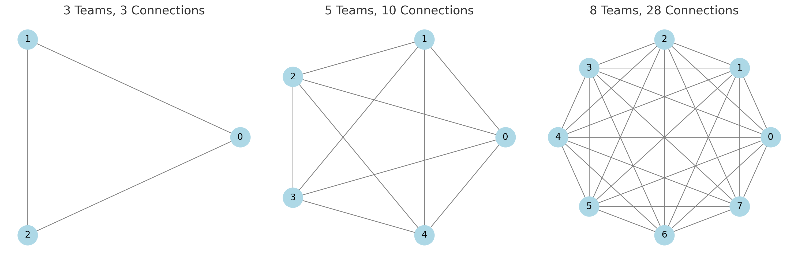

One of my favorite pieces of writing on the intersection of software architecture and business strategy is [Steve Yegge's Google Platforms Rant](https://courses.cs.washington.edu/courses/cse452/23wi/papers/yegge-platform-rant.html). Published in 2011 for an internal audience at Google but accidentally leaked to the rest of the internet, it remains essential reading almost fifteen years later. It isn't perfect, and some pieces (like its core thesis!) haven't aged well, but its insights into how and why software architecture intersects with business strategy and organization structure are timeless.

## The core argument

Google (as of 2011) did most things better than Amazon, per Yegge, but the few things that Amazon did better than Google more than made up for the difference. The most significant thing that Amazon did right was invest heavily in a technical strategy that forced them to platformize their internal systems, using the following (summarized) rules:

1. All teams expose their data and functionality through service interfaces.
2. Teams must communicate with each other through these interfaces.
3. No other form of interprocess communication are allowed.
4. All services must be designed from the ground up to be externalizable.

In other words, they went hard into SOA.

Doing this bought Amazon two things: it cut down on the need for cross-team communication by forcing all negotiation over resources through service boundaries, and it allowed them to turn those service boundaries into monetizable products, should they so choose—anything useful enough for Amazon to build for itself can be offered in the market to others. You can see through this how they might have arrived at S3 and EC2, the two early anchor products in the AWS ecosystem.

Furthermore, he argued that Google risked losing in the market if they don't take a platform-first strategy seriously. In this specific example, his belief was that Google+, a Facebook competitor, was ultimately going to fail in the market due to poor platform support, although with hindsight I don't think it was the key issue there. However, it remains an issue with GCP.

## The lessons I take away from this

To me, Yegge's rant is a bit of a Rosetta Stone for high-tech architecture strategy. It answers a number of questions about how and why companies arrive at that place, how architecture intersects (or doesn't) with business strategy, and why Google's strengths aren't always outmatched by its weaknesses. I think it also contains a number of lessons essential to engineering leaders looking to drive a services-oriented architecture strategy, and I come back to it periodically to revise and sharpen my understanding of where my own org is heading.

You could spend all day picking it apart, but here's what I get out of it.

### In a tech company, architecture should match business strategy

Form follows function. Amazon adopted SOA because they were trying to solve a business problem, not a tech problem, which is how to effectively monetize investments in platform-level software. Amazon SOA strategey was literally driven and mandated by the founder, born out of a vision of how he wanted his company to grow. It wasn't a consequence of engineering-led ambition.

If you have no intention, ever, of becoming a platform company, SOA has some downsides, and there are workable alternatives.

### Monorepos are an under-discussed, workable alternative to SOA for certain business strategies

Reading between the lines, understood for Yegge's audience of Google employees but not mentioned explicitly: monorepos have notable tradeoffs when trying to build a tractable architecture at scale. A shocking number of major west-coast high-tech companies do this in some form or scale—Facebook, Google, Apple, Stripe—but for a variety of reasons have not caught on elsewhere. Multi-repo SOA, however, is _not_ peak software engineering. It is _hard_, and the strategy makes it easy to solve certain problems in isolation, in part by allowing your organization to punt on a bunch of stuff (monorepo build tools like Bazel disallow circular dependencies by design, for example, and SOA doesn't), it's not the right way for every team.

### As organizations grow, cross-team collaboration is an _antipattern_

One of the business problems that Amazon was trying to solve was _how to organize teams._ This is a hard-won lesson for me personally, but Bezos knew it in his bones early: asking teams to reach across boundaries is impractical, because the number of comms connections explodes as the org grows. Decoupling teams also helps force service-level autarky and encapsulation, which can avoid distributed-monolith problems later.

### Pick your teams to reflect the architecture you want, not the other way around

The [Inverse Conway Maneuver](https://martinfowler.com/bliki/ConwaysLaw.html) describes a org structure strategy intended to produce the desired architecture structure by building teams intended to reflect that structure rather than evolving them independently. Creating teams independent of your services topology and then asking everyone to cross domain boundaries to ship is workable but slow; trickling changes across the stack from service to service can take days or even weeks as each intermediate team reviews and critiques the requisite change requests, to say nothing of the cost and effort of multiple architecture reviews, or whatever your local equivalent is. Focus is everything. Lose that and you lose your productivity gains from an SOA strategy.

### Services gain value when they solve real problems, both for customers and other teams

I'm a "services capitalist": services accrete value organically based on an organization's understanding of its needs, not by perfectly fitting themselves to a paper definition of a domain boundary. Furthermore, _the team trying to add the value drives the work_. Presumptive externalizability is likewise good policy here even if you never sell them to a customer, because it forces you towards a model in which services have to solve real, sharp, well-encapsulated problems in order to gain adoption.

### There's more than one kind of valuable service

Most SOAs have a wide variety of other services that fit into various niches in service of demonstrating and driving value. Worry less about whether a given service owns its own data, and more about whether the problem that service is solving is valuable enough to drive adoption and force the issue. If a service is _valuable enough_, and solves real problems quickly, you can afford to worry about source-of-truth later.

### A service's technical domain fully includes everything required to encapsulate its business domain

In the Amazon model, you _have_ to fully encapsulate your domain, because _teams aren't allowed to talk to one another_. You can't and shouldn't trust them. A lot of teams try to duck hard implications of this, like service-level IAM-style authorization, but you can't correctly externalize a system without it. Amazon services may not understanding everything about every user, but they're perfectly capable of granting access on the basis of the IAM permissions the caller has. Service contracts should include cross-functional considerations like these.

### SOA is not a trivial architecture

And there's more than twenty years of industry lessons to draw from when building yours. Teams often try it because it seems fun and nimble and it lets you duck a bunch of sticky conversations about how much to centralize tech and architecture decisions—I think of it as somewhat fatalistic in that regard—but those conversations _matter_. If Amazon discovered that "QA and monitoring are a continuum" fifteen years ago, don't wait for your engineers to discover the same lesson organically. You don't have that kind of time. Learn from others' mistakes.

### 9. Finally, Yegge's core thesis was wrong in a significant way, and architecture isn't destiny

Google+ didn't lose because of Google's platform strategy (probably, with the benefit of hindsight), and Facebook didn't win because of one. Social networks are often just difficult to tear down once they're popular because of their network effects. You could argue, though, and Yegge subsequently has indirectly, that GCP is struggling for broadly the same reasons. I'd caution against reading too much into the argument contemporaneously, because I don't think it was right, but it remains a useful and compelling read. Finally, there exist legions of successful companies which row uphill against these principles and succeed anyway: Stripe is a platform company with a monorepo, for example, and there are plenty of mediocre SOA strategies driving real value absent a platform business strategy.
